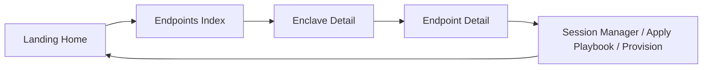

# Feature 008: Endpoint Management

**Overview:** Add a new Django app "endpoints" that provides enclave drill-down and endpoint management screens (EC2 and WorkSpaces), with actions such as Session Manager connect, apply Ansible playbook, and provision pipelines, integrated into the existing UI and navigation.

This document is the implementation plan for Cursor Cloud Agents. Work from this spec in order (one feature per branch); use backend contracts in `backend/existing-state/contracts/` as the source of truth for invocation and payloads.

---

## 1. Scope and boundaries

- **Resources in scope:** EC2 instances and Amazon WorkSpaces deployed in SRE enclaves. Most will be SSM managed instances; the UI must **not** restrict to managed-only—show all endpoints, but only **registered (SSM-managed)** endpoints get "Connect via Session Manager" and node-based operations.
- **Backend:** Use **existing-state** contracts for operations and pipelines; do not invent payloads. Where the backend does not yet expose data (enclave list, endpoint list), add **proposed-changes** under `backend/proposed-changes/queries/` and implement the frontend to work with mock/empty data until those queries exist.
- **Session Manager:** There is no Lambda operation for "connect." Provide a **Session Manager** action as a link (e.g. AWS Console SSM deep link) or documented CLI snippet (`aws ssm start-session --target <instance-id> --region <region>`) for managed instances only.
- **Relevant contracts (existing):**
  - `backend/existing-state/contracts/operations/apply-ansible-playbook.yaml`: `node_id` (managed instance ID), `playbook`, `destination_account_id`, `mode`, etc.
  - `backend/existing-state/contracts/operations/apply-playbook-to-node.yaml`: same idea for pipeline rerun path; requires `destination_region`.
  - Pipelines: `provision-linux-workspace`, `provision-windows-workspace`, `provision-ec2-instance`—all support or use `node_id` for rerun or playbook application.

---

## 2. Backend data (proposed queries)

The console currently has **no** query to list enclaves or endpoints. Enclaves are hardcoded in `landing/views.py` as `SAMPLE_ENCLAVES`.

- **Enclave list:** Keep using the same source as landing for now (e.g. `SAMPLE_ENCLAVES` or a shared helper). Optionally add `backend/proposed-changes/queries/list-enclaves.yaml` for a future backend-owned list; frontend can switch to it when available.
- **Endpoint list per enclave:** Add **proposed** query contract(s) so the backend team can implement:
  - **list-managed-instances** (or **list-endpoints**): inputs e.g. `destination_account_id`, `destination_region`; returns list of SSM managed instances (e.g. `instance_id`, `name`, `platform`, `ping_status`, `resource_type: "ec2" | "workspace"` if distinguishable).
  - Optionally **list-workspaces**: same scope, returns WorkSpaces (e.g. `workspace_id`, `state`, `user`, `directory_id`, `region`). If the backend prefers one combined **list-endpoints** that returns both EC2 and WorkSpaces, use that shape in the proposal.

Implement the endpoints app to call these queries when configured; when the backend does not yet support them, use empty list or mock data (same pattern as `landing/events/list-pipeline-executions.json` and mock backend).

---

## 3. Django app structure

- **New app:** `endpoints` (create with `startapp` or equivalent structure).
- **Register:** Add `endpoints` to `sre_console/settings.py` `INSTALLED_APPS` and include its URLs in `sre_console/urls.py` under a prefix (e.g. `path("endpoints/", include("endpoints.urls"))`).
- **URLs (suggested):**
  - `/endpoints/` — list enclaves (index).
  - `/endpoints/<enclave_id>/` — enclave detail: list resources (EC2, WorkSpaces) for that enclave. `enclave_id` can be `destination_account_id` to align with landing.
  - `/endpoints/<enclave_id>/<resource_type>/<resource_id>/` — endpoint detail (e.g. EC2 instance or WorkSpace); actions live here.
- **Templates:** Reuse `landing/templates/landing/base.html` (``) so header, nav, and styles are shared. Use `endpoints/templates/endpoints/` for app-specific templates.

---

## 4. Screens and behavior

### 4.1 Enclave list (index)

- **View:** List enclaves from the same source as the landing pipeline form (e.g. import `SAMPLE_ENCLAVES` from landing or a shared module; later replace with list-enclaves query).
- **Template:** Table or card list: enclave name, research group, account ID; each row/card links to enclave detail (using `destination_account_id` as identifier).
- **Nav:** Breadcrumb or back link to landing and to Endpoints home.

### 4.2 Enclave detail (resources per enclave)

- **View:** Accept `enclave_id` (e.g. `destination_account_id`). Resolve enclave metadata (name, research group) from the same enclave source. Call proposed query **list-managed-instances** (or **list-endpoints**) with `destination_account_id` and `destination_region` (default e.g. `us-east-1` from `landing/forms.py` `DEFAULT_REGION`).
- **Template:** Table of endpoints: type (EC2 / WorkSpace), resource id, name (if any), SSM status (for managed), region. Each row links to endpoint detail.
- **If query not implemented:** Show empty state or sample rows with a note that data will appear when the backend supports the query.

### 4.3 Endpoint detail (single resource actions)

- **View:** Accept `enclave_id`, `resource_type` (ec2 | workspace), `resource_id` (instance_id or workspace_id). Load enclave and endpoint info (from enclave detail context or a small "get endpoint" query if added later).
- **Template:**
  - Identify the endpoint (type, id, name, region, SSM managed yes/no).
  - **Actions (only for SSM-registered endpoints where applicable):**
    - **Connect via Session Manager:** Link to AWS Console SSM Session Manager or display CLI snippet: `aws ssm start-session --target <instance-id> --region <region>`. No backend call.
    - **Apply Ansible playbook:** Form built from `apply-ansible-playbook` contract: `operation`, `mode`, `destination_account_id`, `node_id` (prefilled), `playbook` (e.g. `managed-workspace.yaml`, `managed-instance.yaml`). Submit via POST to an endpoints view that invokes the management Lambda (same pattern as landing's execute_operation: build payload from contract, call `get_backend().invoke_operation(payload)`).
    - **Apply playbook to node (rerun):** For WorkSpaces/rerun path, use `apply-playbook-to-node` with `node_id`, `destination_region`, `playbook`, `mode`; same invocation pattern.
  - **Pipelines (for provisioning):** Link to existing landing start screens for provision-linux-workspace, provision-windows-workspace, provision-ec2-instance (e.g. with `?enclave=<destination_account_id>`). Optionally prefill `node_id` for "rerun playbook on this node" where the pipeline supports it.
- **Do not limit** the endpoint list to managed-only; show all endpoints. Disable or hide "Connect via Session Manager" and node-scoped operations when the endpoint is not SSM-registered (or show "Register in SSM to enable" message).

---

## 5. Invoking operations from the endpoints app

- **Backend abstraction:** Reuse `landing/backend/real.py` (and mock) via `get_backend()` so the same ARN settings and invocation logic apply. The endpoints app should **not** duplicate Lambda/Step Functions calls; it should call the same backend layer.
- **Payload construction:** Read `invocation.payload.required` and `invocation.payload.optional` from the **existing-state** operation contracts (apply-ansible-playbook, apply-playbook-to-node). Build the JSON payload exactly as specified; include `operation` and all required/optional inputs. Use the pattern in the contract `example_python`.
- **Contract loading:** Add a helper (in landing or endpoints) to load operation contracts from `backend/existing-state/contracts/operations/` by id and parse `invocation` for payload shape, so the endpoints app stays contract-driven.

---

## 6. Navigation and integration

- **Header nav (base template):** In `landing/templates/landing/base.html`, add an "Endpoints" link next to the Actions dropdown, pointing to the endpoints index. Visible when the user is authenticated.
- **Landing page:** Add a fourth workflow card or prominent link (e.g. "Manage endpoints" / "View endpoints by enclave") that links to `/endpoints/`.
- **Breadcrumbs:** On enclave detail and endpoint detail: Home → Endpoints → [Enclave] → [Endpoint].

---

## 7. Implementation order (suggested)

1. **Proposed query contracts** — Add YAML under `backend/proposed-changes/queries/` for list-enclaves (optional) and list-managed-instances (or list-endpoints) with `invocation` and payload shape.
2. **Create endpoints app** — Django app skeleton, `INSTALLED_APPS`, urls included, empty views for index, enclave detail, endpoint detail.
3. **Enclave list view + template** — Use shared enclave source; render table/cards with links to enclave detail.
4. **Enclave detail view + template** — Call list-managed-instances (or list-endpoints) via backend; handle "query not implemented" with empty or mock data; render resources table with links to endpoint detail.
5. **Endpoint detail view + template** — Show single endpoint; Session Manager link/snippet; Apply Ansible playbook (and apply-playbook-to-node) forms; links to start-pipeline-execution for provision-* pipelines with enclave prefill.
6. **Operation execution from endpoints** — POST handler that builds payload from contract and calls `get_backend().invoke_operation(payload)`; return JSON for in-page success/error (similar to unlock-user modal).
7. **Navigation** — Add "Endpoints" to base.html nav; add "Manage endpoints" to landing home.
8. **Shared contract loader (optional but recommended)** — Load operation contracts from existing-state for apply-ansible-playbook and apply-playbook-to-node so payloads stay contract-driven.
9. **Tests and docs** — Pytest for endpoints views; update README.md and COMMIT_MSG.txt per project rules.

---

## 8. Diagram (high-level flow)

---

## 9. Files to add or touch (summary)

| Area | Action |
|------|--------|
| `backend/proposed-changes/queries/` | Add list-managed-instances.yaml (or list-endpoints.yaml); optionally list-enclaves.yaml |
| `endpoints/` | New app: urls.py, views.py, templates/endpoints/*.html; reuse landing base template and backend |
| `sre_console/settings.py` | Add `endpoints` to INSTALLED_APPS |
| `sre_console/urls.py` | Include endpoints.urls under `endpoints/` |
| `landing/templates/landing/base.html` | Add "Endpoints" nav link |
| `landing/templates/landing/home.html` | Add card or link to /endpoints/ |
| Shared enclave/contract code | Optional: move SAMPLE_ENCLAVES or contract loader to shared module used by landing and endpoints |
| README.md, COMMIT_MSG.txt | Update per project rules after implementation |

---

## 10. Out of scope for this feature

- Cognito or other auth changes.
- Limiting endpoints to SSM-only in the list (show all; disable SSM-only actions when not registered).
- Implementing the actual backend queries (only propose contracts; frontend works with mock/empty until backend provides them).
