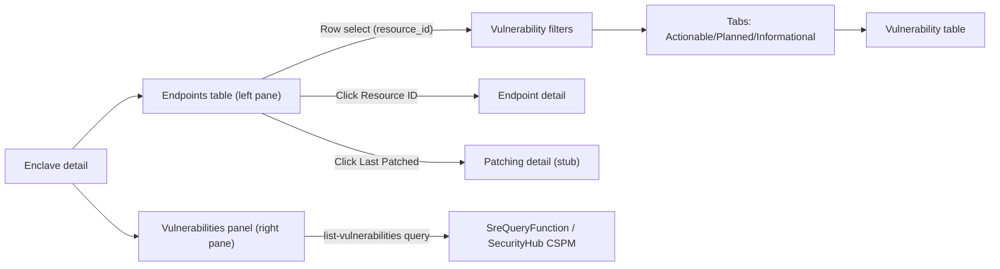

# Feature 009: Vulnerability Management

**Overview:** Extend the enclave endpoints experience with a split-pane layout that surfaces vulnerability data next to the endpoint list, adds patch status for each endpoint, and introduces a configurable vulnerabilities panel backed by a new `list-vulnerabilities` query. Operators should be able to see which endpoints are managed for patching, drill into patching details, and review prioritized vulnerabilities (Actionable, Planned, Informational) with flexible filtering and column visibility persisted per browser.

This document is the implementation plan for Cursor Cloud Agents. Work from this spec in order (one feature per branch); use backend contracts in `backend/existing-state/contracts/` as the source of truth for invocation and payloads, and `backend/proposed-changes/` for suggested additions.

---

## 1. Scope and boundaries

- **Resources in scope:** EC2 instances and Amazon WorkSpaces deployed in SRE enclaves that appear in the existing endpoints app.
- **Patch status:** Surface whether an endpoint is configured in Systems Manager Patch Manager and, when available, the most recent patch time.
- **Vulnerabilities:** Show Security Hub CSPM findings sourced from Amazon Inspector, organized into Actionable / Planned / Informational tabs.
- **Backend contracts:**
  - Continue to use the **authoritative** contracts under `backend/existing-state/contracts/` for current queries/operations.
  - Add a **proposed** query contract `backend/proposed-changes/queries/list-vulnerabilities.yaml` for the new vulnerability feed.
  - Extend the **proposed** `list-endpoints` contract to describe additional patch metadata fields; the existing-state contract remains the backend source of truth until updated.
- **Out of scope:**
  - Implementing the backend logic for `list-vulnerabilities` or Patch Manager integration.
  - Non-endpoint resources (e.g. RDS) or vulnerability sources outside Inspector via Security Hub CSPM.

---

## 2. Existing context

- **Endpoints app:** Implemented in the `endpoints` Django app.
  - **View:** `enclave_detail` in `endpoints/views.py`.
  - **Template:** `endpoints/templates/endpoints/enclave_detail.html`.
  - Uses `list-enclaves` and `list-endpoints` queries (or sample data) to show endpoints by enclave.
- **Endpoint records:**
  - Normalized into `EndpointRecord` in `endpoints/views.py` with fields like `resource_type`, `resource_id`, `name`, `region`, `is_managed`, `node_id`, `ssm_status`.
  - Currently no explicit patch metadata fields.
- **Backend contracts (proposed):**
  - `backend/proposed-changes/queries/list-enclaves.yaml`
  - `backend/proposed-changes/queries/list-endpoints.yaml`

This feature builds on top of that foundation without changing existing behavior for users who ignore the new panel.

---

## 3. Enclave detail layout and endpoints table

### 3.1 Split layout

- **Goal:** Split the enclave detail screen into two coordinated panels:
  - **Left panel:** Endpoint table (enhanced with navigation and patching status).
  - **Right panel:** Vulnerabilities component (Section 5).
- **Template changes (`endpoints/templates/endpoints/enclave_detail.html`):**
  - Wrap the main content beneath the enclave summary in a responsive Bootstrap row:
    - Use a layout such as `col-lg-5` (left, endpoints) and `col-lg-7` (right, vulnerabilities).
    - On small screens, panels should stack vertically (endpoints above vulnerabilities).
  - Keep the existing breadcrumb and enclave header unchanged.

### 3.2 Endpoint table column changes

- **Current columns:** Type, Resource ID, Name, Region, SSM managed, SSM status, Actions.
- **Target columns:**
  - Type
  - Resource ID (now a navigation link)
  - Name
  - Region
  - SSM managed
  - SSM status
  - Last Patched (new; occupies the previous Actions position)

#### Resource ID as a link

- Replace the plain `{{ endpoint.resource_id }}` cell with a link to the existing endpoint detail screen:
  - URL pattern: ``.
- Keep styling consistent with the rest of the console (standard link appearance, not a button).
- Clicking this link **does not** affect row selection for vulnerability filtering (Section 7).

#### Last Patched column

- **Header:** `Last Patched`.
- **Data source:** Patch metadata associated with each endpoint (Section 4.2).
- **Display rules:**
  - If the endpoint is configured in Patch Manager and has a known last patch time, show the date/time (e.g. `2025-07-21 14:32 UTC`).
  - If the endpoint is configured in Patch Manager but has never been patched, show an appropriate placeholder (e.g. `Not yet patched`).
  - If the endpoint is **not** configured in Patch Manager, show `Not Managed`.
- **Interaction:**
  - The displayed value in the Last Patched cell should be a link to the patching detail view for that endpoint (Section 4.1).
  - Clicking this link should **not** toggle row selection in the endpoints table.

---

## 4. Patching detail screen (stub)

### 4.1 Routing and view

- **New route:** Add a named URL in `endpoints/urls.py` for patch detail, e.g.:
  - `/endpoints/<enclave_id>/<resource_type>/<resource_id>/patching/`
  - Name: `endpoints:patch-detail` (or equivalent).
- **View:** Add `patch_detail` in `endpoints/views.py`:
  - Use `_get_enclave_or_404` and `_get_endpoint_or_404` to resolve the enclave and endpoint.
  - No additional backend calls are required for this feature; the view works from the normalized `EndpointRecord` (including patch metadata).

### 4.2 Template and behavior

- **Template:** `endpoints/templates/endpoints/patch_detail.html`.
- **Content (stubbed initially):**
  - Breadcrumb consistent with other endpoints views: Home → Endpoints → Enclave → Endpoint → Patching.
  - Heading summarizing the endpoint (type, ID, enclave).
  - Summary card or table repeating the endpoint information from the enclave endpoints table:
    - Type, Resource ID, Name, Region, SSM managed, SSM status, Last Patched / Not Managed.
  - Placeholder section for future enhancements, e.g. “Patching history and details will appear here when available.”

### 4.3 Patch metadata expectations

- Extend the **proposed** `list-endpoints` contract to include optional patch metadata per endpoint:
  - `last_patched_at: string` — ISO 8601 / RFC 3339 timestamp for the most recent completed patch operation.
  - `patch_managed: boolean` — `true` when the node is configured in Systems Manager Patch Manager.
- Update the `EndpointRecord` dataclass in `endpoints/views.py` to include:
  - `last_patched_at: str | None`
  - `patch_managed: bool`
- Update `_normalize_endpoint` to populate these fields from the query result when present; default to:
  - `last_patched_at = None` if not provided.
  - `patch_managed = False` if not provided (only explicitly set to `True` when backend indicates Patch Manager configuration).

---

## 5. Vulnerabilities panel (right-hand pane)

### 5.1 Placement and structure

- **Location:** Right-hand pane of `enclave_detail.html`, adjacent to the endpoints table.
- **Partial:** Extract the vulnerabilities markup into a reusable partial:
  - `endpoints/templates/endpoints/_vulnerabilities_panel.html`.
  - Include it from the main template and pass in:
    - Enclave identifiers (`destination_account_id`, `region`).
    - Any URLs needed to fetch vulnerability data via AJAX.
- **Panel composition:**
  - Header row:
    - Title (e.g. “Vulnerabilities”).
    - Filter icon (opens filter UI).
    - Settings icon (opens column visibility UI).
  - Scrollable table area:
    - Displays vulnerability records with configurable columns.
  - Tab bar anchored at the bottom:
    - Tabs: **Actionable**, **Planned**, **Informational**.

### 5.2 Tabs and datasets

- All three tabs share the **same table layout and column set**, but represent distinct subsets of the findings:
  - **Actionable:** Items that should be addressed soon (e.g. critical/high, exploitable, fix available).
  - **Planned:** Items scheduled for remediation in future windows.
  - **Informational:** Low-priority or informational findings.
- Each vulnerability record includes a categorical field (e.g. `category`) to distinguish which tab(s) it belongs to.
- Implementation options (both supported by the contract):
  - **Client-filtered:** Load a unified list and filter into three subsets on the client by `category`.
  - **Server-filtered:** Request per-tab data from the backend by providing `category` to `list-vulnerabilities`.
- The UI should clearly indicate the active tab and maintain scroll position per tab where practical.

### 5.3 Table behavior and scrolling

- The vulnerabilities table must scroll **independently** from the rest of the page:
  - Wrap it in a container with a fixed max height and `overflow-y: auto`.
  - Use horizontal scrolling (e.g. Bootstrap `table-responsive`) to accommodate many columns.
- When feasible, keep column headers visible using CSS (e.g. `position: sticky; top: 0;`) inside the scrollable container.

### 5.4 Columns and field mapping

- **User-visible columns (full set):**
  - Assessed Criticality
  - Status
  - Days Open
  - Days Actionable
  - Account ID
  - Type
  - Package Name
  - Installed Version
  - Fixed Version
  - Vulnerability ID
  - Vulnerability Source
  - Vulnerability Reported
  - Fix Available
  - Exploit Available
  - Resource Type
  - Resource ID
  - Tag Name
  - Comments
- **Default visible columns:**
  - Assessed Criticality
  - Status
  - Package Name
  - Vulnerability ID
- **Backend / JS field keys:** Map human-readable columns to stable keys used in contracts and JavaScript, for example:
  - `assessed_criticality`, `status`, `days_open`, `days_actionable`, `account_id`, `finding_type`, `package_name`, `installed_version`, `fixed_version`, `vulnerability_id`, `vulnerability_source`, `vulnerability_reported_at`, `fix_available`, `exploit_available`, `resource_type`, `resource_id`, `tag_name`, `comments`, `category`.

---

## 6. Column visibility settings and local storage

### 6.1 Settings icon and dialog

- **Trigger:** Settings (gear) icon in the vulnerabilities panel header.
- **Behavior:** Opens a dialog (Bootstrap modal) allowing users to choose which columns are visible.
- **Dialog contents:**
  - One checkbox per available column, labeled with the column’s display name.
  - Checkboxes initialized based on current state:
    - Use defaults on first load.
    - Use saved configuration if present in local storage.
  - Validation:
    - At least **one** column must remain selected (cannot save an empty set).
  - Controls:
    - Save/apply changes.
    - Cancel/close without saving.
    - “Restore defaults” to revert to the default visible column set.

### 6.2 Local storage behavior (columns)

- **Storage key:** Use a dedicated namespace, e.g. `sreConsole.vulnerabilityColumns`.
- **On load:**
  - Read the stored configuration (if any).
  - Validate against the current column list (ignore unknown keys).
  - Fall back to defaults if no valid persisted config exists.
- **On save:**
  - Apply the new visibility configuration to the rendered table.
  - Persist the configuration to local storage for future sessions.

---

## 7. Filters, endpoint-driven filtering, and persistence

### 7.1 Filter icon and UI

- **Trigger:** Filter icon located to the **left** of the settings icon.
- **Behavior:** Opens a filter UI (modal or panel) that allows the user to filter vulnerabilities by any of the defined columns.
- **Filter capabilities:**
  - For string-like fields (e.g. Status, Package Name, Vulnerability ID, Tag Name), allow entering a free-text search term.
  - For numeric fields (Days Open, Days Actionable), support specifying a minimum and/or maximum value.
  - For boolean/flag fields (Fix Available, Exploit Available), allow simple options (e.g. Any / Yes / No).
  - Provide clear actions:
    - **Apply filters** (update the vulnerabilities table).
    - **Clear all filters** (reset to unfiltered view).

### 7.2 Endpoint row selection as a filter source

- **Row selection behavior:**
  - Clicking the **row background** (not on a link) in the endpoints table selects that endpoint.
  - The selected row is highlighted (e.g. via a CSS class) to provide visual feedback.
  - Clicking the same row again clears the selection.
- **Effect on vulnerabilities:**
  - Selecting an endpoint sets a `resource_id` filter in the vulnerabilities component, narrowing results to findings that apply to that endpoint.
  - The vulnerabilities panel should show a small indication (e.g. a badge or label) that it is filtered by a specific endpoint.
  - Clearing filters via the filter UI or by toggling the row de-selection should also clear this `resource_id` filter.

### 7.3 Filter persistence (local storage)

- **Storage key:** Use a dedicated key, e.g. `sreConsole.vulnerabilityFilters`.
- **Persisted state should include:**
  - Per-column filter criteria (text terms, numeric ranges, booleans).
  - The endpoint-driven `resource_id` filter, if active.
- **On load:**
  - Restore filters from local storage, apply them to the table, and reflect them in the filter UI.
  - Re-apply endpoint selection styling if a `resource_id` filter is present and the corresponding row exists.
- **Interaction with tabs:**
  - Filters apply within the active tab’s dataset.
  - Filters remain active across tab switches; the tab choice only controls which subset (Actionable/Planned/Informational) is considered before filtering.

---

## 8. Backend query: list-vulnerabilities (proposed)

- **Location:** `backend/proposed-changes/queries/list-vulnerabilities.yaml`.
- **Purpose:** Provide normalized vulnerability data for the vulnerabilities panel, reading from **AWS Security Hub CSPM** and restricted to **Amazon Inspector** findings.
- **Invocation contract:**
  - Target: `SreQueryFunction`.
  - Method: `lambda.invoke`.
  - Invocation type: `RequestResponse`.
  - `payload.required`:
    - `query: list-vulnerabilities`
    - `destination_account_id: string`
  - `payload.optional` (examples):
    - `destination_region: string`
    - `resource_id: string` (for endpoint-specific views).
    - `category: string` (one of `actionable`, `planned`, `informational`).
    - `filters: object` (map of field keys to filter criteria, should the backend support server-side filtering).
- **Inputs section:**
  - Required: `destination_account_id` (and `destination_region` if backend requires region scoping).
  - Optional: `resource_id`, `category`, `filters`, `destination_region`.
- **Outputs section (success list fields):**
  - `assessed_criticality`
  - `status`
  - `days_open`
  - `days_actionable`
  - `account_id`
  - `finding_type`
  - `package_name`
  - `installed_version`
  - `fixed_version`
  - `vulnerability_id`
  - `vulnerability_source`
  - `vulnerability_reported_at`
  - `fix_available`
  - `exploit_available`
  - `resource_type`
  - `resource_id`
  - `tag_name`
  - `comments`
  - `category`
- The contract should explicitly note that the backend is responsible for mapping raw Security Hub / Inspector fields into this schema and categorizing findings into Actionable, Planned, or Informational.

---

## 9. Frontend integration and data flow

- **Enclave detail view (`endpoints/views.py`):**
  - Continue to load enclave and endpoints via existing helpers.
  - Provide the template with:
    - `enclave.destination_account_id` and `region`.
    - Any URLs required for JavaScript to call a JSON endpoint for vulnerabilities.
- **Vulnerabilities data endpoint (JSON):**
  - Add a small JSON view (e.g. `enclave_vulnerabilities`) under `endpoints/views.py`:
    - Accepts enclave/account/region and optional `category`, `resource_id`, and filter parameters.
    - Calls `get_backend().run_query` with the `list-vulnerabilities` payload.
    - Returns a JSON payload suitable for the front-end JS (e.g. `{ "vulnerabilities": [...] }`), or an empty list plus a message if the query is not yet implemented.
- **JavaScript behavior (inline or static file):**
  - Initialize from DOM data attributes rendered into `_vulnerabilities_panel.html` (e.g. enclave ID, region, data endpoint URL).
  - Load vulnerabilities for the active tab via `fetch`.
  - Maintain in-memory state for:
    - Current tab.
    - Column visibility.
    - Filters and endpoint selection.
  - Re-render the table whenever the active tab, columns, filters, or endpoint selection change.

---

## 10. Implementation order (suggested)

1. **Contract updates**
   - Add `backend/proposed-changes/queries/list-vulnerabilities.yaml`.
   - Extend `backend/proposed-changes/queries/list-endpoints.yaml` outputs to include patch metadata fields.
2. **Endpoint model and table**
   - Extend `EndpointRecord` and `_normalize_endpoint` to handle patch metadata.
   - Update sample endpoint data to include example patching values.
   - Update `enclave_detail.html` to:
     - Use a split layout.
     - Convert Resource ID to a link.
     - Replace Actions with a Last Patched column that links to the patch detail view.
3. **Patching detail view**
   - Add `patch_detail` view, URL, and `patch_detail.html` template.
4. **Vulnerabilities panel shell**
   - Add `_vulnerabilities_panel.html` and include it from `enclave_detail.html`.
   - Implement the panel header, tabs, and scrollable table container.
5. **Vulnerabilities data plumbing**
   - Add the vulnerabilities JSON view in `endpoints/views.py` and expose its URL to the template.
   - Implement JS to fetch and render vulnerability data per tab.
6. **Column configuration and filters**
   - Implement settings and filter dialogs, wiring them to JS.
   - Add local storage integration for column visibility and filters, plus endpoint row selection linkage.
7. **Tests and docs**
   - Add/extend tests for new views and helpers.
   - Update `README.md` and `COMMIT_MSG.txt` per project rules after implementation.

---

## 11. Files to add or update (summary)

| Area | Action |
|------|--------|
| `backend/proposed-changes/queries/` | Add `list-vulnerabilities.yaml`; extend `list-endpoints.yaml` outputs with patch metadata fields. |
| `endpoints/views.py` | Extend `EndpointRecord`, `_normalize_endpoint`; add patch detail view and vulnerabilities JSON endpoint. |
| `endpoints/templates/endpoints/enclave_detail.html` | Convert to split layout; update endpoints table columns/links; include vulnerabilities panel. |
| `endpoints/templates/endpoints/_vulnerabilities_panel.html` | New partial for vulnerabilities panel (header, tabs, table container, dialogs). |
| `endpoints/templates/endpoints/patch_detail.html` | New patching detail view template. |
| JS (inline or static) | Add script for vulnerabilities panel behavior, filters, and local storage. |
| `README.md`, `COMMIT_MSG.txt` | Update to describe the new vulnerability management feature. |

---

## 12. Diagram (high-level flow)

